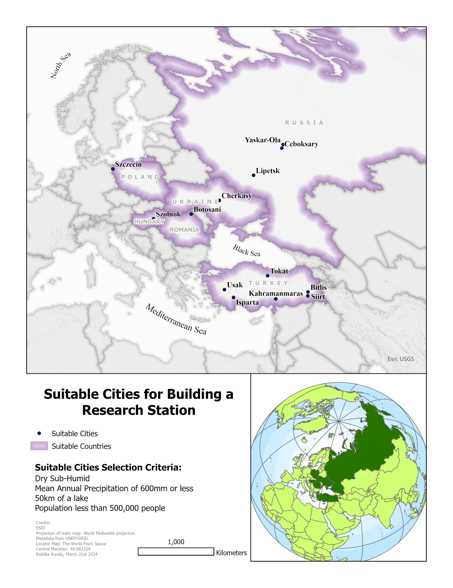

# Site-Suitability-Analysis

**Research Station Site Selection Project**

This project focuses on identifying suitable sites for building a research station based on specific selection criteria. Using geoprocessing tools and spatial analysis, I analyzed various environmental factors and developed a workflow to determine optimal locations.

**The following map was produced using ArcGIS for this project:**

**Data Sources**
* Humidity Index Polygon Layer
* Annual Precipitation Polygon Layer
* Cities Point Layer
* Lakes Polygon Layer

**Methodology**
* Data Preparation: Downloaded and projected four shapefiles using the batch project tool.
* Criteria Filtering: Applied selection criteria:
* Selected dry sub-humid areas from the humidity layer.
* Identified cities with populations greater than 500,000.
* Isolated areas with annual precipitation of 600mm or less.
* Geoprocessing Tools: Used the buffer tool for areas within 50km of lakes and the intersect tool to find locations matching all criteria.
* Final Output: Created an executive summary map and write-up highlighting suitable cities and countries for research stations.

**Things I Learned**
* Geoprocessing Skills: Improved my ability to filter, join, and analyze spatial data.
* Complex Spatial Queries: Gained experience in using advanced geoprocessing tools like buffer, intersect, and select by attribute.
* Workflow Development: Created step-by-step workflows for complex geospatial analyses.
* Spatial Visualization: Enhanced my skills in map design and visual hierarchy to effectively communicate spatial data.
